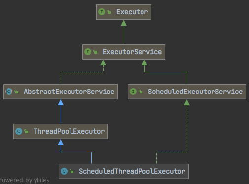
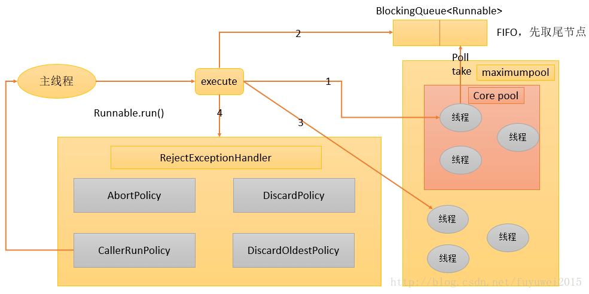
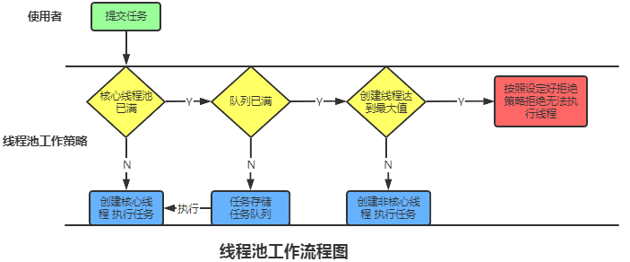

#### JUC多线程及高并发

> [一文看懂JUC多线程及高并发](https://juejin.cn/post/6844904190704091149)

## 一、Volatile

> demo: [com/base/c08thread/a01volatile.java](https://github.com/ylksty/awsjdk/blob/master/src/main/java/com/base/c08thread/a01volatile.java)

### 1.保证可见性

- JMM(java内存模型)
  - 线程拷贝主内存共享变量，操作后，写回主内存
- 存在的问题
  - 线程A修改X值未写回，B也对X操作，A写回主内存，B不可见。也即工作内存与主内存延迟的现象
- 解决：**volatile**
  - 当多个线程访问同一个变量时，一个线程修改了这个变量的值，其他线程能立即看到修改的值

### 2.不保证原子性

> java.util.concurrent.atomic.AtomicInteger 整数原子引用

- 原子性
  - 不可分割、完整性，中间不能被加塞或分割，要么同时成功，要么同时失败
- 解决办法
  - 使用JUC的**AtomicInterger**

### 3.禁止指令重排

- 指令重排
  - 指JVM为了提高性能，擅自改变没有依赖的指令顺序
- 指令重排过程
  - 源代码 - 编辑器优化的重排 - 指令并行的重排 - 内存系统的重排 - 最终执行的指令
- 内存屏障作用
  - 保证特定操作的执行顺序
  - 保证某些变量的内存可见性（利用该特性实现volatile的内存可见性）

### 4.哪里用到

- 单例模式**DCL**（Double Check Lock 双端检锁机制）在加锁前和加锁后都进行一次判断


## 二、CAS

> demo: [com/base/c08thread/a02cas.java](https://github.com/ylksty/awsjdk/blob/master/src/main/java/com/base/c08thread/a02cas.java)

### 1.什么是CAS

> java.util.concurrent.atomic.AtomicReference 原子引用

- CAS全称
  - Compare-And-Set，是一条CPU并发原语
- 功能
  - 判断内存某个位置值是否为预期值，如果是则更新为新的值，不是返回false，过程是原子的
- CAS并发源语体现在Java语言中就是**sun.miscUnSafe**类中的各个方法，调用UnSafe类中的CAS方法，JVM会帮我实现CAS汇编指令，这是一种完全依赖于**硬件**功能，通过它实现了原子操作，再次强调，由于CAS是一种系统源语，源语属于操作系统用于范畴，是由若干个指令组成，用于完成某个功能的一个过程，并且源语的执行必须是连续的，在**执行过程中不允许中断，也即是说CAS是一条原子指令，不会造成所谓的数据不一致的问题**

### 2.CAS原理

> sun.misc.Unsafe

```java
public final boolean compareAndSet(int expect, int update) {
    return unsafe.compareAndSwapInt(this, valueOffset, expect, update); //引出问题 --> 何为unsafe
}
```


### 3.何为UnSafe

- UnSafe是**CAS的核心类**，由于Java方法无法直接访问底层，需要通过本地（native）方法来访问，UnSafe相当于一个后面，基于该类可以直接操作额定的内存数据。UnSafe类在于**sun.misc**包中。其中内部方法可以向C的指针一样直接操作内存，因为Java中CAS操作的主要依赖于UnSafe类的方法

- 变量 **ValueOffset** ， 是该变量在内存中偏移地址，因为**UnSafe就是根据内存偏移地址来获取数据的**。

- 变量 value 由 **volatile** 修饰，保证了多线程之间的可见性。

### 4.CAS缺点

1. 循环时间开销很大

   ```java
   public final int getAndAddInt(Object var1, long var2, int var4) {
       int var5;
       do {
         var5 = this.getIntVolatile(var1, var2);
       } while(!this.compareAndSwapInt(var1, var2, var5, var5 + var4));
   
       return var5;
   }
   ```

   

2. 只能保证一个共享变量的原子性

   - 当对一个共享变量执行操作的时候，我们可以使用循环CAS的方式来保证原子操作，但是对多个共享变量操作时，循环CAS就无法保证操作的原子性，这个时候就可以用锁来保证原子性。

3. 存在ABA问题

### 5.ABA问题

> java.util.concurrent.atomic.AtomicStampedReference 戳原子引用

- 何为ABA问题
  - 在一个时间差的时段内会造成数据的变化。比如说一个线程AA从内存中取走A，这个时候另一个线程BB也从内存中取走A，这个时候A的值为X，然后线程BB将A的值改为Y，过一会又将A的值改为X，这个时候线程AA回来进行CAS操作发现内存中A的值仍然是X，因此线程AA操作成功。**但是尽管线程AA的CAS操作成功，但是不代表这个过程就是没问题的**
- 解决
  - 

## 三、集合类不安全问题

> demo: [com/base/c08thread/a03arrayerr.java](https://github.com/ylksty/awsjdk/blob/master/src/main/java/com/base/c08thread/a03arrayerr.java)

### 1.故障现象

- java.util.ConcurrentModificationException

### 2.导致原因

```java
ArrayList<String> list = new ArrayList<>(); // java.util.ConcurrentModificationException
for (int i = 0; i < 10; i++) {
  new Thread(() -> {
    list.add(UUID.randomUUID().toString().substring(0, 8));
    System.out.println(list);
  }, String.valueOf(i)).start();
}
```

### 3.解决

> java.util.concurrent.CopyOnWriteArrayList 写时赋值

- **Vector** ：线程安全
- **Collections.synchronizedList(new ArrayList<>())**
- **new CopyOnWriteArrayList<>()**
- 写时赋值
  - List线程：`new CopyOnWriteArrayList<>();`
  - Array线程：`new CopyOnWriteArraySet<>();`
  - Set线程：`ConcurrentHashMap();`

## 四、锁

> demo：[com/base/c08thread/a04lock](https://github.com/ylksty/awsjdk/blob/master/src/main/java/com/base/c08thread/a04lock)

### 4.1.公平锁、非公平锁

> java.util.concurrent.locks.ReentrantLock 可重入锁
>
> demo: ReenterLockDemo

- 公平锁：FIFO，效率相对低
  - new ReentrantLock(true)
- 非公平锁：不用排队，抢到为止，效率相对高
  - new ReentrantLock() // 默认false

### 4.2.可重入锁（递归锁）

> 线程可以进入任何一个它已经拥有了的锁的同步着的代码块
>
> java.util.concurrent.locks.ReentrantLock 可重入锁
>
> demo: ReenterLockDemo

### 4.3.自旋锁

> 尝试获取锁的线程，获得锁失败，循环尝试获得
>
> java.util.concurrent.atomic.AtomicReference 原子引用
>
> demo: SpinLockDemo

- 应用，CAS问题的unsafe类
- 好处：减少线程切换
- 缺点：消耗CPU

### 4.4.独占锁（写）、共享锁（读）、互斥锁

> java.util.concurrent.locks.ReentrantReadWriteLock 可重入读写锁
>
> demo: ReadWriteLockDemo
>
> - 按锁的索取顺序安排线程执行顺序

- 独占锁：同时只能被一个线程持有
- 共享锁：同时可以给多个线程持有
- ReentrantLock
  - 读锁是共享锁，写锁是独占锁
  - 读锁共享保证并发
  - 读写、写读，写写的过程互斥

### 4.5.CountDownLatch

> 让一个线程阻塞，直到另一些线程完成一系列操作后才被唤醒
>
> java.util.concurrent.CountDownLatch 倒数锁上，等待触发
>
> demo: CountDownLatchDemo

- 步骤
  - 倒数注册：`CountDownLatch countDownLatch = new CountDownLatch(6);` 
  - 主线程堵塞：`countDownLatch.await()`
  - 直到`countDownLatch.countDown()`完成数达到阈值
  - 主线程执行后续代码

### 4.6.CyclicBarrier

> 阻塞到一定数量，集体触发
>
> java.util.concurrent.CyclicBarrier 循环屏障
>
> demo: CyclicBarrierDemo

- 步骤

  - 注册屏障

    ```java
    CyclicBarrier cyclicBarrier = new CyclicBarrier(7, () -> {
      System.out.println(Thread.currentThread().getName() + "\t召唤神龙");
    });
    ```

  - `cyclicBarrier.await()` 一些线程被阻塞

  - 直到线程数达到阈值，刚好达到阈值的线程，召唤神龙

  - 被阻塞线程无序执行后续代码

### 4.7.Semaphore

> 信号量用于两个目的，一个是用于多个共享资源的互斥使用，另一个用于并发线程数的控制
>
> java.util.concurrent.Semaphore 信号
>
> demo: SemaphoreDemo

- 注册锁：`Semaphore semaphore = new Semaphore(3);`
- 抢锁：`semaphore.acquire();`
  - 抢到：执行代码，释放锁 `semaphore.release();`
  - 抢不到：阻塞

## 五、阻塞队列

> 自动阻塞，自动唤醒，FIFO，超时
>
> demo：[com/base/c08thread/a05blockingqueue](https://github.com/ylksty/awsjdk/blob/master/src/main/java/com/base/c08thread/a05blockingqueue)

### 5.1.种类

> *吞吐量*：SynchronusQueue > LinkedBlockingQueue > ArrayBlockingQueue

1. **ArrayBlockingQueue**：数组结构，有界阻塞队列，FIFO
2. **LinkedBlockingQueue**：链表结构，有界(Integer.MAX_VALUE)阻塞队列，FIFO，吞吐量比ArrayBlockingQueue高
3. **SynchronusQueue**：不存储元素的阻塞队列，生产消费交替，吞吐量比LinkedBlockingQueue高
4. PriorityBlockingQueue：支持优先排序的无界阻塞队列
5. DelayQueue：使用优先级队列实现的延迟无界阻塞队列
6. LinkedTransferQueue：由链表结构组成的无界阻塞队列
7. LinkedBlockingDeque：由链表结构组成的双向阻塞队列

### 5.2.使用好处

> 不需要关系什么时候需要阻塞和唤醒线程，BlockingQueue一手包办。

### 5.3.核心方法

| 方法类型 | 抛出异常  | 特殊值   | 阻塞   | 超时                 |
| -------- | --------- | -------- | ------ | -------------------- |
| 插入     | add(e)    | offer(e) | put(e) | offer(e, time, unit) |
| 移除     | remove()  | poll()   | take() | poll(time, unit)     |
| 检查     | element() | peek()   | 不可用 | 不可用               |

- 抛异常
- 特殊值：返回true 或 false
- 一直阻塞
- 超时退出：返回true 或 false

### 5.4.用处

- 生产者消费者模式

  - 传统版 demo：ProdConsumer_Traditional

    - ```java
      private Lock lock = new ReentrantLock();
      private Condition condition = lock.newCondition();
      ```

    - 生产 `lock.lock();`

      - 检查数量`while (atomicInteger.get() != 0){`
        - 有：`condition.await();`
        - 没有：生产`atomicInteger.incrementAndGet();`
      - 通知唤醒`condition.signalAll();`
      - 阻塞中的进程回到检查数量

  - 同步队列demo，对标上面传统版 demo：SynchronousQueueDemo

    - 注册：`SynchronousQueue<Object> synchronousQueue = new SynchronousQueue<>();`
    - 生产：`synchronousQueue.put(item);`
    - 消费：Object poll = synchronousQueue.poll(1, TimeUnit.SECONDS);
      - 成功
      - 没有产品，

  - 阻塞队列 demo: ProdConsumer_BlockQueueDemo

    - 注册阻塞队列：`new LinkedBlockingDeque<>(3)`
    - 生产
      - 生产：`blockingQueue.offer(data, 1, TimeUnit.SECONDS)`
        - 成功
        - 数量超过，失败
    - 消费
      - 消费：`blockingQueue.poll(1, TimeUnit.SECONDS)`
        - 成功
        - 队列空，失败

- 线程池

- 消息中间件

## 六、线程池

> 概念：主要是控制运行的线程数量，处理过程中将任务加入队列，然后在线程创建后启动这些任务，如果线程数超过最大数量，超出的线程将等待，等待其他线程执行完毕，再从队列中取出任务执行。
>
> 特点：
>
> - 线程复用
> - 控制最大并发数
> - 管理线程
>
> 优点：
>
> - 降低资源消耗，重复利用已创建的线程，减低线程创建和销毁造成的消耗
> - 提高响应速度，任务到达时，不需要创建线程，就能立即执行
> - 提高线程可管理性，线程是稀缺资源，无限创建不仅消耗系统资源，还会降低系统稳定性，使用线程池可以统一分配，调优，监控
>
> demo: [com/base/c08thread/a06threadpool](https://github.com/ylksty/awsjdk/blob/master/src/main/java/com/base/c08thread/a06threadpool)

### 6.1.线程创建的几种方法

> demo: [com/base/c08thread/a06threadpool/ThreadCreatedDemo.java](https://github.com/ylksty/awsjdk/blob/master/src/main/java/com/base/c08thread/a06threadpool/ThreadCreatedDemo.java)

1. 继承Thread

   ```java
   public class ThreadDemo extends Thread {
       @Override
       public void run() {
         	System.out.println("ThreadDemo 运行中...");
       }
   }
   ```

2. 实现Runnable接口

   ```java
   new Thread(() -> {
   		System.out.println(Thread.currentThread().getName() + "\t运行中...");
   }, "RunnableDemo").start();
   ```

3. 实现Callable

   ```java
   @AllArgsConstructor
       public static class IQTaskDemo implements Callable<Integer> {
           private String name;
           private int iq;
   
           @Override
           public Integer call() throws Exception {
               System.out.println(Thread.currentThread().getName() + "\t" + name);
               Thread.sleep(1000);
               return iq;
           }
       }
   // -----
   FutureTask<Integer> joe = new FutureTask<>(new IQTaskDemo("joe", 100));
   new Thread(joe, "A").start();
   Integer joeIQ = joe.get();
   ```

### 6.2.架构说明

- Java中的线程池使用过Excutor框架实现的，该框架中用到了**Executor**，**Executors**，**ExecutorService**，**ThreadPoolExecutor**这几个类。



### 6.3.重点了解

- **Executors.newFixedThreadPool()**

  ```java
  public static ExecutorService newFixedThreadPool(int nThreads) {
      return new ThreadPoolExecutor(nThreads, nThreads,
                                    0L, TimeUnit.MILLISECONDS,
                                    new LinkedBlockingQueue<Runnable>());
  }
  ```

- **Executors.newSingleThreadExecutor()**

  ```java
  public static ExecutorService newSingleThreadExecutor() {
      return new FinalizableDelegatedExecutorService
          (new ThreadPoolExecutor(1, 1,
                                  0L, TimeUnit.MILLISECONDS,
                                  new LinkedBlockingQueue<Runnable>()));
  }
  ```

- **Executors.newCachedThreadPool()**

  ```java
  public static ExecutorService newCachedThreadPool() {
      return new ThreadPoolExecutor(0, Integer.MAX_VALUE,
                                    60L, TimeUnit.SECONDS,
                                    new SynchronousQueue<Runnable>());
  }
  ```

### 6.4.七大参数

| 参数                    | 作用                                                         |
| ----------------------- | ------------------------------------------------------------ |
| corePoolSize            | 线程池中常驻核心线程数                                       |
| maximunPoolSize         | 线程池能够容纳并行最大线程数，需>=1                          |
| keepAliveTime           | 多于空闲线程的存活时间，空闲时间超过销毁，直到剩下corePoolSize |
| TimeUnit                |                                                              |
| workQueue               | 阻塞任务队列                                                 |
| threadFactory           | default                                                      |
| RejectedExcutionHandler | 拒绝策略                                                     |

### 6.5.线程池工作原理





### 6.6.拒绝策略

- 均实现**RejectExecutionHandler**接口

- AbortPolicy（默认）：RejectedException
- CallerRunPolicy：调用者运行
- DiscardOldestPolicy：抛弃队列最老的任务
- DiscardPolicy：丢弃

### 6.7.为何不用JDK创建线程池的方法

> 阿里巴巴 java 开发手册
> `【强制】`线程资源必须通过线程池提供，不允许在应用中自行显示创建线程。说明：使用线程池的好处是**减少在创建和销毁线程上所消耗的时间以及系统资源的开销，解决资源不足的问题。如果不使用线程池，有可能造成系统创建大量同类线程而导致消耗完内存或者“过度切换”的问题。**
> `【强制】` 线程池不允许使用Executors去创建，而是通过ThreadPoolExecutor的方式，这样的处理方式让写的同学更加明确线程池的运行规则，规避资源耗尽的风险。
>
> 1. `FixedThreadPool` 和 `SingleThreadPool`：允许的请求队列长度为Integer.MAX_VALUE，可能会堆积大量的请求，从而导致OOM。
> 2. `CacheThreadPool` 和 `ScheduledThreadPool` ：允许创建线程的数量为Integer.MAX_VALUE，可能会创建大量的线程，从而导致OOM。

### 6.8.合理配置线程池

- **CPU密集型**
  - 查看本机CPU核数：`Runtime.getRuntime().availableProcessors()`
  - CPU密集的意思是该任务需要大量的运算，而没有阻塞，CPU需一直全速运行。
  - CPU密集任务只有在真正的多核CPU上才可能得到加速（通过多线程）
  - CPU密集型任务配置尽可能少的线程数量 => 公式：CPU核数+1个线程的线程池
- **IO密集型**
  - 由于IO密集型任务线程并不是一直在执行任务，则应配置尽可能多的线程，如CPU核数 * 2 
  - IO密集型，是说明该任务需要大量的IO，即大量的阻塞。所以在单线程上运行IO密集型的任务会导致浪费大量的CPU运算能力浪费在等待上，所以要使用多线程可以大大的加速程序运行，即使在单核CPU上，这种加速主要就是利用了被浪费掉的阻塞时间。
  - 配置线程公式：CPU核数 / 1-阻塞系数（0.8~0.9） =>如8核CPU：8 / 1 - 0.9 = 80个线程数


## 七、死锁编码及定位分析

### 7.1.什么是死锁

> 死锁是指两个或两个以上的进程在执行过程中，因争夺资源而造成的一种互相等待的现象，如果无外力的干涉那么它们将无法推进下去，如果系统的资源充足，进程的资源请求都能够得到满足，死锁出现的可能性就很低，否则会因争夺有限的资源而陷入死锁。

### 7.2.造成的原因

- 资源系统不足
- 进程运行推进的顺序不合适
- 资源分配不当

### 7.3.解决方法

- `jps -l` 命令定位进程编号
- `jstack pid` 找到死锁查看

